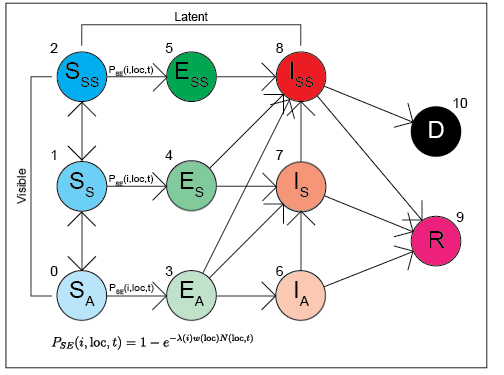
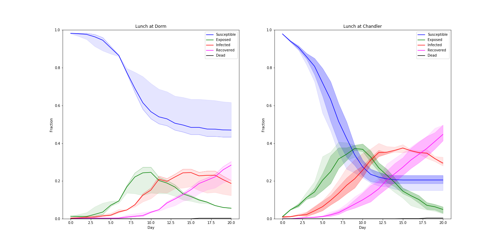
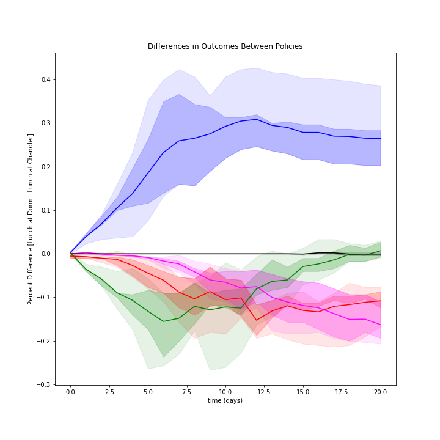
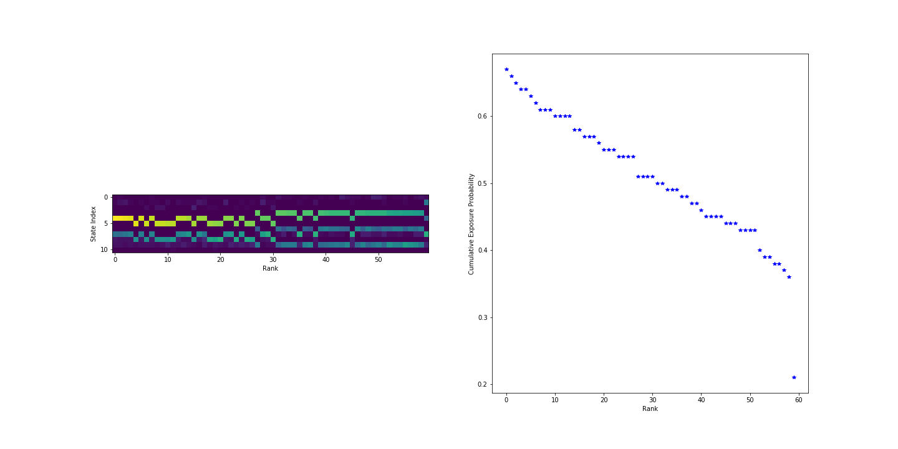

### CoViD Model (Updated 200714)

Just to recap; each agent "owns" two Markov chains. One determines location and is completely independent and the other one determines state and is dependant on the agent's current location. The "location" chain is fully-connected and updated every 5 minutes with movement biased towards a "home" location. The state chain is updated once daily from a calculated "cumulative exposure." The state chain is shown below.

All model code has been put into a separate module for easier use.

Simulations are "run" on the Caltech campus with different locations being represented. The simulation testing lunch policy uses the following locations; Chandler, Bechtel and each of the 3 North Houses (Lloyd, Page, Ruddock). A standard simulation uses the following 10 locations; Broad, Moore, Watson, Beckman, Noyes, Braun, Schlinger, Kerckhoff, Spalding, Chandler.

 Below is a visualization of student movement and model dynamics across the 10 locations on campus outlined above. Agents are colored by their disease status according to the network defined above.

To determine whether it's better for students to eat lunch in their dorms vs Chandler, a full simulation with 300 people was run over a 14 day period. It was assumed 150 students are assigned to Bechtel house and 50 students are assigned to each of the North houses. Running the simulation with these many people is computationally expensive, so confidence intervals were drawn using only 10 trials (execution time ~ 4 hours).

It's a little hard to see the difference between the two policies so I've plotted the differences between the two policies with bootstrapped confidence intervals below

It's still a small difference, but you can expect to infect 5% less people (over a 14 day period) if you shut down Chandler and force students to eat in their dorms.

I'm still working on cherry picking disease sensitivity to get a number bigger than 5%.

State forecasting is also implemented according to the algorithm specified in Antonio's notes. Given a partially-observable initial system state (assuming we can see symptoms along with disease status from individuals with CURRENT test results) and a fully-observable set of locations visited by each agent, a distribution over state at t+1 for every agent is generated. This is done by Monte Carlo methods, with a different initial state sampled at the begining of each MC trial, according to the information supplied. The cumulative exposure for each agent is also calculated from the list of visited locations. 

The figure above shows the results of a forecast. The left plot shows the distribution over states for every individual. The plot on the right shows the probability that an individual will be in any of the "exposed" states at time t+1. Individuals are sorted according to the plot on the right in descending order. This information could be useful when deciding how to ration diagnostic tests. A "greedy" policy can be easily implemented by drawing a threshold and testing everyone above it. I'm currently working on demonstrating this policy in a python notebook. So far, it seems to work best without a delay between when a diagnostic test is administered and when results are received.

 
There's a couple directions we could go at this point.
 
 

### 1. Make the model more usable (build a website), rework visualizations

Right now, all visualizations are done in a JuPytR notebook with static plots being generated (and coded) by hand. I could rework the visualization code to make it interactive and output to a website. The thing I have in mind is something like this CoViD "dashboard" built by JHU.

https://gisanddata.maps.arcgis.com/apps/opsdashboard/index.html#/bda7594740fd40299423467b48e9ecf6

This way, the results of a simulation (or tables of data in the case above) could be easily viewed/interacted with (zoom in on/plot by locations, view summary statistics, control time) without knowledge of how to generate graphs.

The website can be easily built using the azle.js framework and embedding graphs generated using d3.js and Observable notebooks.

 
 

### 2. Calculating an "optimal" testing policy via Machine Learning (Reinforcement Learning) algorithms

The greedy testing policy outlined above is probably not the best choice. There's very little justification that goes behind it besides "testing the people most likely to be infected."

Developing more sophisticated policies necessitates the use of machine learning algorithms, particularly the branch known as Reinforcement Learning (RL). The general goal of these set of algorithms is to learn a policy that maximizes a set of rewards. Given the current system state, the RL algorithm should generate a probability distribution over the set of all actions that we can possibly take that reflects the optimal policy.

Since I don't have a set of equations that describes the time evolution of the system, I'm restricted to the 'model-free' class of RL algorithms, Q-learning to be exact. For anything but very simple problems (which this isn't), deep learning has to be used. I've got a couple whitepapers from Google DeepMind describing the process; I should be able to code it up.

Tensorflow (Google's deep-learning framework) can be used to build and train neural networks. Unfortunately since it is deep learning, we'll need to use (GPU instances) on AWS or Google Cloud Compute.  

